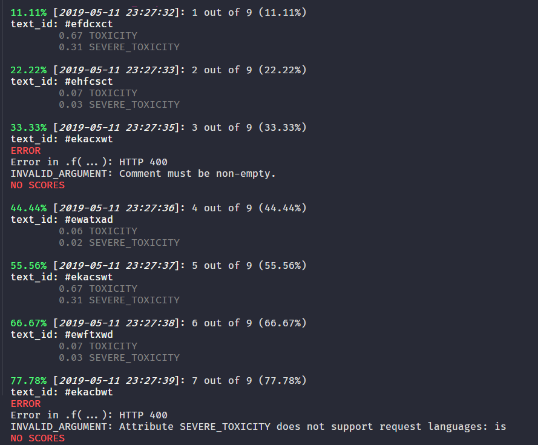

```{r, setup, echo = F}
knitr::opts_chunk$set(message = F, warning = F)
```

# peRspective 


```{r, echo = FALSE, results='asis', eval = T}

library(badger)

git_repo <- "favstats/peRspective"

cat(
  badge_custom("My 1st Package", "Ever", "magenta"),
  badge_travis(git_repo),
  "[](https://codecov.io/gh/favstats/peRspective?branch=master)",
	badge_code_size(git_repo),
	badge_last_commit(git_repo)
)
```


Perspective is an API that uses machine learning models to score the perceived impact a comment might have on a conversation. [Website](http://www.perspectiveapi.com/).

`peRspective` provides access to the API using the R programming language.

For an excellent documentation of the Perspective API see [here](https://github.com/conversationai/perspectiveapi/blob/master/api_reference.md).

> This is a work-in-progress project and I welcome feedback and pull requests!

## Overview

+ [Setup](https://github.com/favstats/peRspective#setup)
+ [Models](https://github.com/favstats/peRspective#models)
+ [Usage](https://github.com/favstats/peRspective#usage)
    + [`prsp_score`](https://github.com/favstats/peRspective#prsp_score)
    + [`prsp_stream`](https://github.com/favstats/peRspective#prsp_stream)


## Setup

### Get an API key

1. Create a Google Cloud project in your [Google Cloud console](https://console.developers.google.com/)
2. Go to [Perspective API's overview page](https://console.developers.google.com/apis/api/commentanalyzer.googleapis.com/overview) and click **Enable**
3. Go to the [API credentials page](https://console.developers.google.com/apis/credentials), just click **Create credentials**, and choose "API Key".

Now you are ready to make a request to the Perspective API!

### Quota and character length Limits

Be sure to check your quota limit! You can learn more about Perspective API quota limit by visiting [your google cloud project's Perspective API page](https://console.cloud.google.com/apis/api/commentanalyzer.googleapis.com/quotas).

The maximum text size per request is 3000 bytes.

## Models

For detailed overview of the used models [see here](https://github.com/conversationai/perspectiveapi/blob/master/api_reference.md).

Here is a list of models currently supported by `peRspective`:

```{r, echo=F}
library(tidyverse)

tibble::tribble(
  ~`Model Attribute Name`,  ~Version,                                  ~`Supported Languages`,   ~`Short Description`,
             "TOXICITY",     "Alpha",                                  "en, es, fr\\*, de\\*",    "rude, disrespectful, or unreasonable comment that is likely to make people leave a discussion.",  
      "SEVERE_TOXICITY",     "Alpha",                                  "en, es, fr\\*, de\\*",    "Same deep-CNN algorithm as TOXICITY, but is trained on 'very toxic' labels.",
      "IDENTITY_ATTACK",     "Experimental toxicity sub-attribute",    "en, fr\\*, de\\*, es\\*", "negative or hateful comments targeting someone because of their identity.",
               "INSULT",     "Experimental toxicity sub-attribute",    "en, fr\\*, de\\*, es\\*", "insulting, inflammatory, or negative comment towards a person or a group of people.",
            "PROFANITY",     "Experimental toxicity sub-attribute",    "en, fr\\*, de\\*, es\\*", "swear words, curse words, or other obscene or profane language.",
    "SEXUALLY_EXPLICIT",     "Experimental toxicity sub-attribute",    "en, fr\\*, de\\*, es\\*", "contains references to sexual acts, body parts, or other lewd content.",
               "THREAT",     "Experimental toxicity sub-attribute",    "en, fr\\*, de\\*, es\\*", "describes an intention to inflict pain, injury, or violence against an individual or group.",
           "FLIRTATION",     "Experimental toxicity sub-attribute",    "en, fr\\*, de\\*, es\\*", "pickup lines, complimenting appearance, subtle sexual innuendos, etc.",
     "ATTACK_ON_AUTHOR",     "NYT moderation models",                  "en",                      "Attack on the author of an article or post.",
  "ATTACK_ON_COMMENTER",    "NYT moderation models",                   "en",                      "Attack on fellow commenter.",
           "INCOHERENT",     "NYT moderation models",                  "en",                      "Difficult to understand, nonsensical.",
         "INFLAMMATORY",     "NYT moderation models",                  "en",                      "Intending to provoke or inflame.",
     "LIKELY_TO_REJECT",     "NYT moderation models",                  "en",                      "Overall measure of the likelihood for the comment to be rejected according to the NYT's moderation.",
              "OBSCENE",     "NYT moderation models",                  "en",                      "Obscene or vulgar language such as cursing.",
                 "SPAM",     "NYT moderation models",                  "en",                      "Irrelevant and unsolicited commercial content.",
        "UNSUBSTANTIAL",     "NYT moderation models",                  "en",                       "Trivial or short comments."
  ) %>% 
  knitr::kable()

```

**Note:** Languages that are annotated with "*" are only accessible in the `_EXPERIMENTAL` version of the models. In order to access them just add to the supplied model string like this: `TOXICITY_EXPERIMENTAL`.

A character vector that includes all supported models can be obtained like this:

```{r}
c(
  peRspective::prsp_models,
  peRspective::prsp_exp_models
)
```

## Usage

First, install package from GitHub:

```{r, eval = F}
devtools::install_github("favstats/peRspective")
```

Load package:

```{r}
library(peRspective)
```

Also the `tidyverse` for examples.

```{r}
library(tidyverse)
```


Define your key variable.

```{r, echo = F}
key <- readr::read_lines("prsp.txt")

Sys.setenv(perspective_api_key = key)

```

`peRspective` functions will read the API key from environment variable `perspective_api_key`. You can assign an environment object like this in your script:


```{r, eval = F}
Sys.setenv(perspective_api_key = "YOUR_API_KEY")
```

### `prsp_score`

Now you can use `prsp_score` to score your comments with various models provided by the Perspective API.

```{r, eval = T}

my_text <- "You wrote this? Wow. This is dumb and childish, please go f**** yourself."

text_scores <- prsp_score(
           text = my_text, 
           languages = "en",
           score_model = peRspective::prsp_models
           )

text_scores %>% 
  gather() %>% 
  mutate(key = fct_reorder(key, value)) %>% 
  ggplot(aes(key, value)) +
  geom_col() +
  coord_flip() +
  ylim(0, 1) +
  geom_hline(yintercept = 0.5, linetype = "dashed") +
  labs(x = "Model", y = "Probability", title = "Perspective API Results")
```

A Trump Tweet:

```{r}
trump_tweet <- "The Fake News Media has NEVER been more Dishonest or Corrupt than it is right now. There has never been a time like this in American History. Very exciting but also, very sad! Fake News is the absolute Enemy of the People and our Country itself!"

text_scores <- prsp_score(
           trump_tweet, 
           score_sentences = F,
           score_model = peRspective::prsp_models
           )

text_scores %>% 
  gather() %>% 
  mutate(key = fct_reorder(key, value)) %>% 
  ggplot(aes(key, value)) +
  geom_col() +
  coord_flip() +
  ylim(0, 1) +
  geom_hline(yintercept = 0.5, linetype = "dashed") +
  labs(x = "Model", y = "Probability", title = "Perspective API Results")
```


Instead of scoring just entire comments you can also score individual sentences with `score_sentences = T`. In this case the Perspective API will automatically split your text into reasonable sentences and score them in addition to an overall score.

```{r, eval = T, fig.width=12, fig.height=8}
trump_tweet <- "The Fake News Media has NEVER been more Dishonest or Corrupt than it is right now. There has never been a time like this in American History. Very exciting but also, very sad! Fake News is the absolute Enemy of the People and our Country itself!"

text_scores <- prsp_score(
           trump_tweet, 
           score_sentences = T,
           score_model = peRspective::prsp_models
           )

text_scores %>% 
  unnest(sentence_scores) %>% 
  select(type, score, sentences) %>% 
  gather(value, key, -sentences, -score) %>% 
  mutate(key = fct_reorder(key, score)) %>% 
  ggplot(aes(key, score)) +
  geom_col() +
  coord_flip() +
  facet_wrap(~sentences, ncol = 2) +
  theme_minimal() +
  geom_hline(yintercept = 0.5, linetype = "dashed") +
  labs(x = "Model", y = "Probability", title = "Perspective API Results")


```

You can also use Spanish (`es`) for `TOXICITY` and `SEVERE_TOXICITY` and `_EXPERIMENTAL`scoring.

```{r}
spanish_text <- "gastan en cosas que de nada sirven-nunca tratan de saber la verdad del funcionalismo de nuestro sistema solar y origen del cosmos-falso por Kepler. LAS UNIVERSIDADES DEL MUNDO NO SABEN ANALIZAR VERDAD O MENTIRA-LO QUE DICE KEPLER"


text_scores <- prsp_score(
           text = spanish_text, 
           languages = "es",
           key = key,
           score_model = c("TOXICITY", "SEVERE_TOXICITY", "INSULT_EXPERIMENTAL")
           )

text_scores %>% 
  gather() %>% 
  mutate(key = fct_reorder(key, value)) %>% 
  ggplot(aes(key, value)) +
  geom_col() +
  coord_flip() +
  geom_hline(yintercept = 0.5, linetype = "dashed")  +
  labs(x = "Model", y = "Probability", title = "Perspective API Results")
```

### `prsp_stream`

So far we have only seen how to get individual comments or sentences scored. But what if you would like to run the function for an entire dataset with a text column? This is where `prsp_stream` comes in. At its core `prsp_stream` is a loop implemented within `purrr::map` to iterate over your text column. To use it let's first generate a mock tibble.

```{r}
text_sample <- tibble(
       ctext = c("You wrote this? Wow. This is dumb and childish, please go f**** yourself.",
                 "I don't know what to say about this but it's not good. The commenter is just an idiot",
                 "This goes even further!",
                 "What the hell is going on?",
                 "Please. I don't get it. Explain it again",
                 "Annoying and irrelevant! I'd rather watch the paint drying on the wall!"),
       textid = c("#efdcxct", "#ehfcsct", 
                  "#ekacxwt",  "#ewatxad", 
                  "#ekacswt",  "#ewftxwd")
       )
```

`prsp_stream` requires a `text` and `text_id column`. It wraps `prsp_score` and takes all its arguments. Let's run the most basic version:

```{r, message=T}
text_sample %>%
  prsp_stream(text = ctext,
              text_id = textid,
              score_model = c("TOXICITY", "SEVERE_TOXICITY"))
```

You receive a `tibble` with your desired scorings including the `text_id` to match your score with your original dataframe.

Now, the problem is that sometimes the call might fail at some point. It is therefore suggested to set `safe_output = TRUE`. This will put the function into a `purrr::safely` environment to ensure that your function will keep running even if you encounter errors. 

Let's try it out with a new dataset that contains text that the Perspective API can't score

```{r}
text_sample <- tibble(
       ctext = c("You wrote this? Wow. This is dumb and childish, please go f**** yourself.",
                 "I don't know what to say about this but it's not good. The commenter is just an idiot",
                 ## empty string
                 "",
                 "This goes even further!",
                 "What the hell is going on?",
                 "Please. I don't get it. Explain it again",
                 ## Gibberish
                 "kdlfkmgkdfmgkfmg",
                 "Annoying and irrelevant! I'd rather watch the paint drying on the wall!",
                 ## Gibberish
                 "Hippi Hoppo"),
       textid = c("#efdcxct", "#ehfcsct", 
                  "#ekacxwt",  "#ewatxad", 
                  "#ekacswt",  "#ewftxwd", 
                  "#eeadswt",  "#enfhxed",
                  "#efdmjd")
       )
```

And run the function with `safe_output = TRUE`.

```{r, message=T}
text_sample %>%
  prsp_stream(text = ctext,
              text_id = textid,
              score_model = c("TOXICITY", "SEVERE_TOXICITY", "INSULT"),
              safe_output = T)
```

`safe_output = T` will also provide us with the error messages that occured so that we can check what went wrong!

Finally, there is one last argument: `verbose = TRUE`. Enable this argument and thanks to [`crayon`](https://github.com/r-lib/crayon) you will receive beautiful console output that guides you along the way, showing you errors and text scores as you go.


```{r, eval = F}
text_sample %>%
  prsp_stream(text = ctext,
              text_id = textid,
              score_model = c("TOXICITY", "SEVERE_TOXICITY"),
              verbose = T,
              safe_output = T)
```



Or the (not as pretty) output in Markdown

```{r, echo = F}
text_sample %>%
  prsp_stream(text = ctext,
              text_id = textid,
              score_model = c("TOXICITY", "SEVERE_TOXICITY"),
              verbose = T,
              safe_output = T)


```