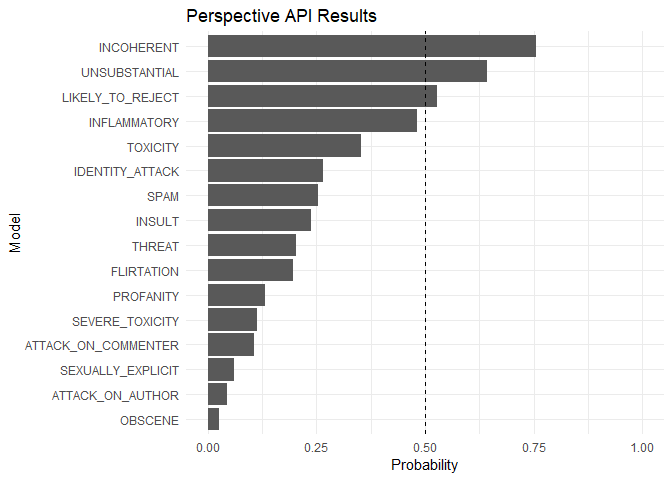

<!-- README.md is generated from README.Rmd. Please edit that file -->

# peRspective 

[](https://cran.rstudio.com/web/packages/peRspective/index.html)
[](https://github.com/favstats/peRspective/actions)
[](https://cran.r-project.org/package=peRspective)
[](https://codecov.io/gh/favstats/peRspective?branch=master)
[](https://github.com/favstats/peRspective)
[](https://github.com/favstats/peRspective/commits/master)

Perspective is an API that uses machine learning models to score the
perceived impact a comment might have on a conversation.
[Website](http://www.perspectiveapi.com/).

`peRspective` provides access to the API using the R programming
language.

For an excellent documentation of the Perspective API see
[here](https://github.com/conversationai/perspectiveapi/tree/master/2-api).

> This is a work-in-progress project and I welcome feedback and pull
> requests!

## Overview

-   [Setup](https://github.com/favstats/peRspective#setup)
-   [Models](https://github.com/favstats/peRspective#models)
-   [Usage](https://github.com/favstats/peRspective#usage)
    -   [`prsp_score`](https://github.com/favstats/peRspective#prsp_score)
    -   [`prsp_stream`](https://github.com/favstats/peRspective#prsp_stream)

## Setup

### Get an API key

[Follow these
steps](https://developers.perspectiveapi.com/s/docs-get-started) as
outlined by the Perspective API to get an API key.

**NOTE:** Perspective API made some changes recently and you now have to
apply for an API key via a Google Form.

### Quota and character length Limits

Be sure to check your quota limit! You can learn more about Perspective
API quota limit by visiting [your google cloud project’s Perspective API
page](https://console.cloud.google.com/apis/api/commentanalyzer.googleapis.com/quotas).

## Models

For detailed overview of the used models [see
here](https://developers.perspectiveapi.com/s/about-the-api-attributes-and-languages).

### Languages in production

Currently, Perspective API has production `TOXICITY` and
`SEVERE_TOXICITY` attributes in the following languages:

-   English (en)
-   Spanish (es)
-   French (fr)
-   German (de)
-   Portuguese (pt)
-   Italian (it)
-   Russian (ru)

### Toxicity attributes

| Attribute name                 | Type  | Description                                                                                                                                                                                                                                                                             | Available Languages                                                                               |
|--------------------------------|-------|-----------------------------------------------------------------------------------------------------------------------------------------------------------------------------------------------------------------------------------------------------------------------------------------|---------------------------------------------------------------------------------------------------|
| `TOXICITY`                     | prod. | A rude, disrespectful, or unreasonable comment that is likely to make people leave a discussion.                                                                                                                                                                                        | English (en), Spanish (es), French (fr), German (de), Portuguese (pt), Italian (it), Russian (ru) |
| `TOXICITY_EXPERIMENTAL`        | exp.  | A rude, disrespectful, or unreasonable comment that is likely to make people leave a discussion.                                                                                                                                                                                        | Arabic (ar)                                                                                       |
| `SEVERE_TOXICITY`              | prod. | A very hateful, aggressive, disrespectful comment or otherwise very likely to make a user leave a discussion or give up on sharing their perspective. This attribute is much less sensitive to more mild forms of toxicity, such as comments that include positive uses of curse words. | en, fr, es, de, it, pt, ru                                                                        |
| `SEVERE_TOXICITY_EXPERIMENTAL` | exp.  | A very hateful, aggressive, disrespectful comment or otherwise very likely to make a user leave a discussion or give up on sharing their perspective. This attribute is much less sensitive to more mild forms of toxicity, such as comments that include positive uses of curse words. | ar                                                                                                |
| `IDENTITY_ATTACK`              | prod. | Negative or hateful comments targeting someone because of their identity.                                                                                                                                                                                                               | de, it, pt, ru, en                                                                                |
| `IDENTITY_ATTACK_EXPERIMENTAL` | exp.  | Negative or hateful comments targeting someone because of their identity.                                                                                                                                                                                                               | fr, es, ar                                                                                        |
| `INSULT`                       | prod. | Insulting, inflammatory, or negative comment towards a person or a group of people.                                                                                                                                                                                                     | de, it, pt, ru, en                                                                                |
| `INSULT_EXPERIMENTAL`          | exp.  | Insulting, inflammatory, or negative comment towards a person or a group of people.                                                                                                                                                                                                     | fr, es, ar                                                                                        |
| `PROFANITY`                    | prod. | Swear words, curse words, or other obscene or profane language.                                                                                                                                                                                                                         | de, it, pt, ru, en                                                                                |
| `PROFANITY_EXPERIMENTAL`       | exp.  | Swear words, curse words, or other obscene or profane language.                                                                                                                                                                                                                         | fr, es, ar                                                                                        |
| `THREAT`                       | prod. | Describes an intention to inflict pain, injury, or violence against an individual or group.                                                                                                                                                                                             | de, it, pt, ru, en                                                                                |
| `THREAT_EXPERIMENTAL`          | exp.  | Describes an intention to inflict pain, injury, or violence against an individual or group.                                                                                                                                                                                             | fr, es, ar                                                                                        |
| `SEXUALLY_EXPLICIT`            | exp.  | Contains references to sexual acts, body parts, or other lewd content.                                                                                                                                                                                                                  | en                                                                                                |
| `FLIRTATION`                   | exp.  | Pickup lines, complimenting appearance, subtle sexual innuendos, etc.                                                                                                                                                                                                                   | en                                                                                                |

### New York Times attributes

These attributes are experimental because they are trained on a single
source of comments—New York Times (NYT) data tagged by their moderation
team—and therefore may not work well for every use case.

| Attribute name        | Type | Description                                                                                         | Language |
|-----------------------|------|-----------------------------------------------------------------------------------------------------|----------|
| `ATTACK_ON_AUTHOR`    | exp. | Attack on the author of an article or post.                                                         | en       |
| `ATTACK_ON_COMMENTER` | exp. | Attack on fellow commenter.                                                                         | en       |
| `INCOHERENT`          | exp. | Difficult to understand, nonsensical.                                                               | en       |
| `INFLAMMATORY`        | exp. | Intending to provoke or inflame.                                                                    | en       |
| `LIKELY_TO_REJECT`    | exp. | Overall measure of the likelihood for the comment to be rejected according to the NYT’s moderation. | en       |
| `OBSCENE`             | exp. | Obscene or vulgar language such as cursing.                                                         | en       |
| `SPAM`                | exp. | Irrelevant and unsolicited commercial content.                                                      | en       |
| `UNSUBSTANTIAL`       | exp. | Trivial or short comments.                                                                          | en       |

A character vector that includes all`peRspective` supported models can
be obtained like this:

``` r
c(
  peRspective::prsp_models,
  peRspective::prsp_exp_models
)
#>  [1] "TOXICITY"                     "SEVERE_TOXICITY"             
#>  [3] "IDENTITY_ATTACK"              "INSULT"                      
#>  [5] "PROFANITY"                    "SEXUALLY_EXPLICIT"           
#>  [7] "THREAT"                       "FLIRTATION"                  
#>  [9] "ATTACK_ON_AUTHOR"             "ATTACK_ON_COMMENTER"         
#> [11] "INCOHERENT"                   "INFLAMMATORY"                
#> [13] "LIKELY_TO_REJECT"             "OBSCENE"                     
#> [15] "SPAM"                         "UNSUBSTANTIAL"               
#> [17] "TOXICITY_EXPERIMENTAL"        "SEVERE_TOXICITY_EXPERIMENTAL"
#> [19] "IDENTITY_ATTACK_EXPERIMENTAL" "INSULT_EXPERIMENTAL"         
#> [21] "PROFANITY_EXPERIMENTAL"       "THREAT_EXPERIMENTAL"
```

## Usage

First, install package from GitHub:

``` r
devtools::install_github("favstats/peRspective")
```

Load package:

``` r
library(peRspective)
```

Also the `tidyverse` for examples.

``` r
library(tidyverse)
```

**Define your key variable.**

`peRspective` functions will read the API key from environment variable
`perspective_api_key`. In order to add your key to your environment
file, you can use the function `edit_r_environ()` from the [`usethis`
package](https://usethis.r-lib.org/).

``` r
usethis::edit_r_environ()
```

This will open your .Renviron file in your text editor. Now, you can add
the following line to it:

``` r
perspective_api_key="YOUR_API_KEY"
```

Save the file and restart R for the changes to take effect.

Alternatively, you can provide an explicit definition of your API key
with each function call using the `key` argument.

### `prsp_score`

Now you can use `prsp_score` to score your comments with various models
provided by the Perspective API.

``` r
my_text <- "You wrote this? Wow. This is dumb and childish, please go f**** yourself."

text_scores <- prsp_score(
           text = my_text, 
           languages = "en",
           score_model = peRspective::prsp_models
           )

text_scores %>% 
  tidyr::gather() %>% 
  dplyr::mutate(key = forcats::fct_reorder(key, value)) %>% 
  ggplot2::ggplot(ggplot2::aes(key, value)) +
  ggplot2::geom_col() +
  ggplot2::coord_flip() +
  ggplot2::ylim(0, 1) +
  ggplot2::geom_hline(yintercept = 0.5, linetype = "dashed") +
  ggplot2::labs(x = "Model", y = "Probability", title = "Perspective API Results")
```


A Trump Tweet:

``` r
trump_tweet <- "The Fake News Media has NEVER been more Dishonest or Corrupt than it is right now. There has never been a time like this in American History. Very exciting but also, very sad! Fake News is the absolute Enemy of the People and our Country itself!"

text_scores <- prsp_score(
           trump_tweet, 
           score_sentences = F,
           score_model = peRspective::prsp_models
           )

text_scores %>% 
  tidyr::gather() %>% 
  dplyr::mutate(key = forcats::fct_reorder(key, value)) %>% 
  ggplot2::ggplot(ggplot2::aes(key, value)) +
  ggplot2::geom_col() +
  ggplot2::coord_flip() +
  ggplot2::ylim(0, 1) +
  ggplot2::geom_hline(yintercept = 0.5, linetype = "dashed") +
  ggplot2::labs(x = "Model", y = "Probability", title = "Perspective API Results")
```



Instead of scoring just entire comments you can also score individual
sentences with `score_sentences = T`. In this case the Perspective API
will automatically split your text into reasonable sentences and score
them in addition to an overall score.

``` r
trump_tweet <- "The Fake News Media has NEVER been more Dishonest or Corrupt than it is right now. There has never been a time like this in American History. Very exciting but also, very sad! Fake News is the absolute Enemy of the People and our Country itself!"

text_scores <- prsp_score(
           trump_tweet, 
           score_sentences = T,
           score_model = peRspective::prsp_models
           )

text_scores %>% 
  tidyr::unnest(sentence_scores) %>% 
  dplyr::select(type, score, sentences) %>% 
  tidyr::gather(value, key, -sentences, -score) %>% 
  dplyr::mutate(key = forcats::fct_reorder(key, score)) %>% 
  ggplot2::ggplot(ggplot2::aes(key, score)) +
  ggplot2::geom_col() +
  ggplot2::coord_flip() +
  ggplot2::facet_wrap(~sentences, ncol = 2) +
  ggplot2::geom_hline(yintercept = 0.5, linetype = "dashed") +
  ggplot2::labs(x = "Model", y = "Probability", title = "Perspective API Results")
```


You can also use Spanish (`es`) for `TOXICITY`, `SEVERE_TOXICITY` and
`_EXPERIMENTAL` models.

``` r
spanish_text <- "gastan en cosas que de nada sirven-nunca tratan de saber la verdad del funcionalismo de nuestro sistema solar y origen del cosmos-falso por Kepler. LAS UNIVERSIDADES DEL MUNDO NO SABEN ANALIZAR VERDAD O MENTIRA-LO QUE DICE KEPLER"


text_scores <- prsp_score(
           text = spanish_text, 
           languages = "es",
           score_model = c("TOXICITY", "SEVERE_TOXICITY", "INSULT_EXPERIMENTAL")
           )

text_scores %>% 
  tidyr::gather() %>% 
  dplyr::mutate(key = forcats::fct_reorder(key, value)) %>% 
  ggplot2::ggplot(ggplot2::aes(key, value)) +
  ggplot2::geom_col() +
  ggplot2::coord_flip() +
  ggplot2::geom_hline(yintercept = 0.5, linetype = "dashed")  +
  ggplot2::labs(x = "Model", y = "Probability", title = "Perspective API Results")
```


**NOTE:** Your provided text will be stored by the Perspective API for
future research. This option is the default. If the supplied texts are
private or any of the authors of the texts are below 13 years old,
`doNotStore` should be set to `TRUE.`

### `prsp_stream`

So far we have only seen how to get individual comments or sentences
scored. But what if you would like to run the function for an entire
dataset with a text column? This is where `prsp_stream` comes in. At its
core `prsp_stream` is a loop implemented within `purrr::map` to iterate
over your text column. To use it let’s first generate a mock tibble.

``` r
text_sample <- tibble(
       ctext = c("You wrote this? Wow. This is dumb and childish, please go f**** yourself.",
                 "I don't know what to say about this but it's not good. The commenter is just an idiot",
                 "This goes even further!",
                 "What the hell is going on?",
                 "Please. I don't get it. Explain it again",
                 "Annoying and irrelevant! I'd rather watch the paint drying on the wall!"),
       textid = c("#efdcxct", "#ehfcsct", 
                  "#ekacxwt",  "#ewatxad", 
                  "#ekacswt",  "#ewftxwd")
       )
```

`prsp_stream` requires a `text` and `text_id` column. It wraps
`prsp_score` and takes all its arguments. Let’s run the most basic
version:

``` r
text_sample %>%
  prsp_stream(text = ctext,
              text_id = textid,
              score_model = c("TOXICITY", "SEVERE_TOXICITY"))
#> Binding rows...
#> # A tibble: 6 x 3
#>   text_id  TOXICITY SEVERE_TOXICITY
#>   <chr>       <dbl>           <dbl>
#> 1 #efdcxct   0.959           0.846 
#> 2 #ehfcsct   0.932           0.534 
#> 3 #ekacxwt   0.0652          0.0248
#> 4 #ewatxad   0.605           0.319 
#> 5 #ekacswt   0.0734          0.0257
#> 6 #ewftxwd   0.350           0.137
```

You receive a `tibble` with your desired scorings including the
`text_id` to match your score with your original dataframe.

Now, the problem is that sometimes the call might fail at some point. It
is therefore suggested to set `safe_output = TRUE`. This will put the
function into a `purrr::safely` environment to ensure that your function
will keep running even if you encounter errors.

Let’s try it out with a new dataset that contains text that the
Perspective API can’t score

``` r
text_sample <- tibble(
       ctext = c("You wrote this? Wow. This is dumb and childish, please go f**** yourself.",
                 "I don't know what to say about this but it's not good. The commenter is just an idiot",
                 ## empty string
                 "",
                 "This goes even further!",
                 "What the hell is going on?",
                 "Please. I don't get it. Explain it again",
                 ## Gibberish
                 "kdlfkmgkdfmgkfmg",
                 "Annoying and irrelevant! I'd rather watch the paint drying on the wall!",
                 ## Gibberish
                 "Hippi Hoppo"),
       textid = c("#efdcxct", "#ehfcsct", 
                  "#ekacxwt",  "#ewatxad", 
                  "#ekacswt",  "#ewftxwd", 
                  "#eeadswt",  "#enfhxed",
                  "#efdmjd")
       )
```

And run the function with `safe_output = TRUE`.

``` r
text_sample %>%
  prsp_stream(text = ctext,
              text_id = textid,
              score_model = c("TOXICITY", "SEVERE_TOXICITY", "INSULT"),
              safe_output = T)
#> # A tibble: 9 x 5
#>   text_id  error                                TOXICITY SEVERE_TOXICITY  INSULT
#>   <chr>    <chr>                                   <dbl>           <dbl>   <dbl>
#> 1 #efdcxct "No Error"                             0.959           0.846   0.958 
#> 2 #ehfcsct "No Error"                             0.932           0.534   0.960 
#> 3 #ekacxwt "Error in .f(...): HTTP 400\nINVALI~  NA              NA      NA     
#> 4 #ewatxad "No Error"                             0.0652          0.0248  0.0309
#> 5 #ekacswt "No Error"                             0.605           0.319   0.322 
#> 6 #ewftxwd "No Error"                             0.0734          0.0257  0.0396
#> 7 #eeadswt "No Error"                             0.143           0.0871  0.131 
#> 8 #enfhxed "No Error"                             0.350           0.137   0.440 
#> 9 #efdmjd  "Error in .f(...): HTTP 400\nINVALI~  NA              NA      NA
```

`safe_output = T` will also provide us with the error messages that
occured so that we can check what went wrong!

Finally, there is one last argument: `verbose = TRUE`. Enable this
argument and thanks to [`crayon`](https://github.com/r-lib/crayon) you
will receive beautiful console output that guides you along the way,
showing you errors and text scores as you go.

``` r
text_sample %>%
  prsp_stream(text = ctext,
              text_id = textid,
              score_model = c("TOXICITY", "SEVERE_TOXICITY"),
              verbose = T,
              safe_output = T)
```


Or the (not as pretty) output in Markdown

    #> 11.11% [2021-07-13 11:52:36]: 1 out of 9 (11.11%)
    #> text_id: #efdcxct
    #>  0.96 TOXICITY
    #>  0.85 SEVERE_TOXICITY
    #> 
    #> 22.22% [2021-07-13 11:52:37]: 2 out of 9 (22.22%)
    #> text_id: #ehfcsct
    #>  0.93 TOXICITY
    #>  0.53 SEVERE_TOXICITY
    #> 
    #> 33.33% [2021-07-13 11:52:38]: 3 out of 9 (33.33%)
    #> text_id: #ekacxwt
    #> ERROR
    #> Error in .f(...): HTTP 400
    #> INVALID_ARGUMENT: Comment must be non-empty.
    #> NO SCORES
    #> 
    #> 44.44% [2021-07-13 11:52:39]: 4 out of 9 (44.44%)
    #> text_id: #ewatxad
    #>  0.07 TOXICITY
    #>  0.02 SEVERE_TOXICITY
    #> 
    #> 55.56% [2021-07-13 11:52:40]: 5 out of 9 (55.56%)
    #> text_id: #ekacswt
    #>  0.60 TOXICITY
    #>  0.32 SEVERE_TOXICITY
    #> 
    #> 66.67% [2021-07-13 11:52:41]: 6 out of 9 (66.67%)
    #> text_id: #ewftxwd
    #>  0.07 TOXICITY
    #>  0.03 SEVERE_TOXICITY
    #> 
    #> 77.78% [2021-07-13 11:52:42]: 7 out of 9 (77.78%)
    #> text_id: #eeadswt
    #>  0.14 TOXICITY
    #>  0.09 SEVERE_TOXICITY
    #> 
    #> 88.89% [2021-07-13 11:52:43]: 8 out of 9 (88.89%)
    #> text_id: #enfhxed
    #>  0.35 TOXICITY
    #>  0.14 SEVERE_TOXICITY
    #> 
    #> 100.00% [2021-07-13 11:52:45]: 9 out of 9 (100.00%)
    #> text_id: #efdmjd
    #> ERROR
    #> Error in .f(...): HTTP 400
    #> INVALID_ARGUMENT: Attribute SEVERE_TOXICITY does not support request languages: ja-Latn
    #> NO SCORES
    #> # A tibble: 9 x 4
    #>   text_id  error                                        TOXICITY SEVERE_TOXICITY
    #>   <chr>    <chr>                                           <dbl>           <dbl>
    #> 1 #efdcxct "No Error"                                     0.959           0.846 
    #> 2 #ehfcsct "No Error"                                     0.932           0.534 
    #> 3 #ekacxwt "Error in .f(...): HTTP 400\nINVALID_ARGUME~  NA              NA     
    #> 4 #ewatxad "No Error"                                     0.0652          0.0248
    #> 5 #ekacswt "No Error"                                     0.605           0.319 
    #> 6 #ewftxwd "No Error"                                     0.0734          0.0257
    #> 7 #eeadswt "No Error"                                     0.143           0.0871
    #> 8 #enfhxed "No Error"                                     0.350           0.137 
    #> 9 #efdmjd  "Error in .f(...): HTTP 400\nINVALID_ARGUME~  NA              NA

## Citation

Thank you for using peRspective! Please consider citing:

Votta, Fabio. (2019). peRspective: A wrapper for the Perspective API.
Source: <https://github.com/favstats>.

<div>

Icons made by
<a href="https://www.freepik.com/?__hstc=57440181.1504a979705d81fb44d4169a0ccdf2ae.1558036002089.1558036002089.1558036002089.1&__hssc=57440181.4.1558036002090&__hsfp=2902986854" title="Freepik">Freepik</a>
from
<a href="https://www.flaticon.com/"               title="Flaticon">www.flaticon.com</a>
is licensed by
<a href="http://creativecommons.org/licenses/by/3.0/"              title="Creative Commons BY 3.0" target="_blank">CC
3.0 BY</a>

</div>
