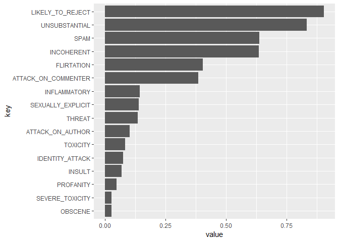

peRspective
================

Perspective is an API that uses machine learning models to score the
perceived impact a comment might have on a conversation.
[Website](http://www.perspectiveapi.com/).

`peRspective` provides access to the API using the R programming
language.

For an excellent documentation of the Perspective API see
[here](https://github.com/conversationai/perspectiveapi/blob/master/api_reference.md).

## Setup

### API authorization

In order to get the Perspective API working you need to create a Google
Cloud project in your [Google Cloud
console](https://console.developers.google.com/). You can also use an
existing project, if you have one.

Once you have a project set up go to [Perspective API’s overview
page](https://console.developers.google.com/apis/api/commentanalyzer.googleapis.com/overview)
and click ***Enable***.

Finally, you need to obtain an API key. You can do this on the [API
credentials
page](https://console.developers.google.com/apis/credentials), just
click ***Create credentials***, and choose “API Key”. Story your API key
safely.

Now you are ready to make a request to the Perspective API\!

### Quota and character length Limits

You can check your quota limits by going to [your google cloud project’s
Perspective API
page](https://console.cloud.google.com/apis/api/commentanalyzer.googleapis.com/quotas),
and check your projects quota usage at [the cloud console quota usage
page](https://console.cloud.google.com/iam-admin/quotas).

The maximum text size per request is 3000 bytes.

### In R

Install package from GitHub:

``` r
devtools::install_github("favstats/peRspective")
```

Load package:

``` r
library(peRspective)
```

Also the `tidyverse` for examples.

``` r
library(tidyverse)
```

## Models

### Alpha

The following alpha models are **recommended** for use. They have been
tested across multiple domains and trained on hundreds of thousands of
comments tagged by thousands of human moderators. These are available in
**English (en) and Spanish (es)**.

  - **TOXICITY**: rude, disrespectful, or unreasonable comment that is
    likely to make people leave a discussion. This model is a
    [Convolutional Neural
    Network](https://en.wikipedia.org/wiki/Convolutional_neural_network)
    (CNN) trained with
    [word-vector](https://www.tensorflow.org/tutorials/word2vec) inputs.
  - **SEVERE\_TOXICITY**: This model uses the same deep-CNN algorithm as
    the TOXICITY model, but is trained to recognise examples that were
    considered to be ‘very toxic’ by crowdworkers. This makes it much
    less sensitive to comments that include positive uses of curse-words
    for example. A labelled dataset and details of the methodolgy can be
    found in the same [toxicity
    dataset](https://figshare.com/articles/Wikipedia_Talk_Labels_Toxicity/4563973)
    that is available for the toxicity model.

### Experimental

#### Experimental toxicity sub-attributes definitions

The following experimental models give more fine-grained classifications
than overall toxicity. They were trained on a relatively smaller amount
of data compared to the primary toxicity models above and have not been
tested as thoroughly.

  - **IDENTITY\_ATTACK**: negative or hateful comments targeting someone
    because of their identity.
  - **INSULT**: insulting, inflammatory, or negative comment towards a
    person or a group of people.
  - **PROFANITY**: swear words, curse words, or other obscene or profane
    language.
  - **THREAT**: describes an intention to inflict pain, injury, or
    violence against an individual or group.
  - **SEXUALLY\_EXPLICIT**: contains references to sexual acts, body
    parts, or other lewd content.
  - **FLIRTATION**: pickup lines, complimenting appearance, subtle
    sexual innuendos, etc.

For more details on how these were trained, see the [Toxicity and
sub-attribute annotation
guidelines](https://github.com/conversationai/conversationai.github.io/blob/master/crowdsourcing_annotation_schemes/toxicity_with_subattributes.md).

### New York Times moderation models

The following experimental models were trained on New York Times data
tagged by their moderation team.

  - **ATTACK\_ON\_AUTHOR**: Attack on the author of an article or post.
  - **ATTACK\_ON\_COMMENTER**: Attack on fellow commenter.
  - **INCOHERENT**: Difficult to understand, nonsensical.
  - **INFLAMMATORY**: Intending to provoke or inflame.
  - **LIKELY\_TO\_REJECT**: Overall measure of the likelihood for the
    comment to be rejected according to the NYT’s moderation.
  - **OBSCENE**: Obscene or vulgar language such as cursing.
  - **SPAM**: Irrelevant and unsolicited commercial content.
  - **UNSUBSTANTIAL**: Trivial or short comments.

Here is a list of currently supported models:

| Model Attribute Name  | Version                             | Supported Languages |
| :-------------------- | :---------------------------------- | :------------------ |
| TOXICITY              | Alpha                               | en, es              |
| SEVERE\_TOXICITY      | Alpha                               | en, es              |
| IDENTITY\_ATTACK      | Experimental toxicity sub-attribute | en                  |
| INSULT                | Experimental toxicity sub-attribute | en                  |
| PROFANITY             | Experimental toxicity sub-attribute | en                  |
| SEXUALLY\_EXPLICIT    | Experimental toxicity sub-attribute | en                  |
| THREAT                | Experimental toxicity sub-attribute | en                  |
| FLIRTATION            | Experimental toxicity sub-attribute | en                  |
| ATTACK\_ON\_AUTHOR    | NYT moderation models               | en                  |
| ATTACK\_ON\_COMMENTER | NYT moderation models               | en                  |
| INCOHERENT            | NYT moderation models               | en                  |
| INFLAMMATORY          | NYT moderation models               | en                  |
| LIKELY\_TO\_REJECT    | NYT moderation models               | en                  |
| OBSCENE               | NYT moderation models               | en                  |
| SPAM                  | NYT moderation models               | en                  |
| UNSUBSTANTIAL         | NYT moderation models               | en                  |

A character vector that includes all supported models can be obtained
like this:

``` r
peRspective::prsp_models
```

    ##  [1] "TOXICITY"            "SEVERE_TOXICITY"     "IDENTITY_ATTACK"    
    ##  [4] "INSULT"              "PROFANITY"           "SEXUALLY_EXPLICIT"  
    ##  [7] "THREAT"              "FLIRTATION"          "ATTACK_ON_AUTHOR"   
    ## [10] "ATTACK_ON_COMMENTER" "INCOHERENT"          "INFLAMMATORY"       
    ## [13] "LIKELY_TO_REJECT"    "OBSCENE"             "SPAM"               
    ## [16] "UNSUBSTANTIAL"

## Usage

First, define your key variable:

``` r
key <- "YOUR_API_KEY"
```

Next, you can use `prsp_score` function to your comments scored with
various models provided by the Perspective API.

``` r
my_text <- "Hello whats going on? Please don't leave. I need to be free."

text_scores <- prsp_score(
           text = my_text, 
           key = key,
           score_model = peRspective::prsp_models
           )

text_scores %>% 
  gather() %>% 
  mutate(key = fct_reorder(key, value)) %>% 
  ggplot(aes(key, value)) +
  geom_col() +
  coord_flip()
```

<!-- -->

Let’s try something else:

``` r
trump_tweet <- "The Fake News Media has NEVER been more Dishonest or Corrupt than it is right now. There has never been a time like this in American History. Very exciting but also, very sad! Fake News is the absolute Enemy of the People and our Country itself!"

text_scores <- prsp_score(
           trump_tweet, 
           key = key,
           score_model = peRspective::prsp_models
           )

text_scores %>% 
  gather() %>% 
  mutate(key = fct_reorder(key, value)) %>% 
  ggplot(aes(key, value)) +
  geom_col() +
  coord_flip()
```

<!-- -->
